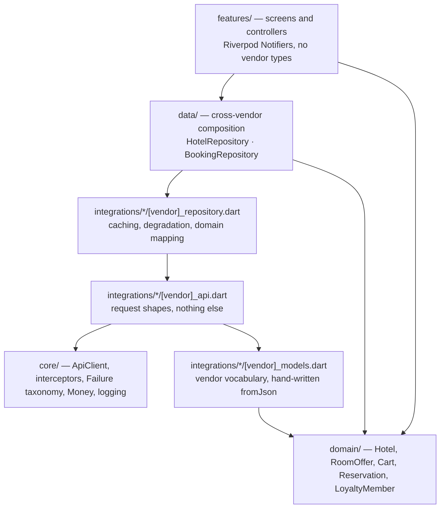
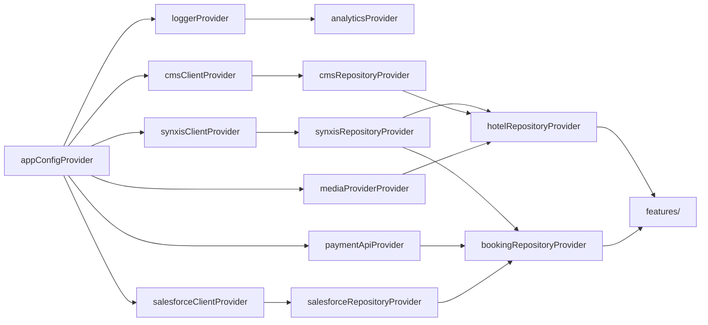

# 01 — Architecture

## The shape of the problem

A luxury OTA app is not a CRUD client with a nice theme. It is a **composition
layer over four systems that disagree with each other**, wrapped in a booking
funnel where a mistake costs real money.

* The **CRS** (SynXis) knows what can be sold and for how much. It is slow,
  rate-limited, and the only authority on availability.
* The **CRM** (Salesforce) knows who the guest is and what they have earned. It
  is fast, but it is not allowed to block a booking.
* The **CMS** knows what the brand says. It changes weekly and must never be
  load-bearing.
* The **media platform** (Leonardo) knows what the hotel looks like. It is a
  CDN, and its main cost is bandwidth on a guest's phone.

Almost every design decision below follows from those four sentences.

## Layers



The rule that keeps this honest: **a vendor's vocabulary never travels upward.**
`RatePlanCode`, `loyaltyProgramMemberId` and `sys.linkType` exist in
`*_models.dart` and nowhere else. A widget that knew what a `QuoteToken` was
would be a bug.

The cost is a mapper per vendor. The benefit is that replacing SynXis with
another CRS touches two files, and that every screen can be tested without any
vendor at all.

## The composition root

[`lib/app/providers.dart`](../lib/app/providers.dart) is the whole dependency
graph, top to bottom, in one file. Read it as a map:



Every node is overridable. That is not a nicety — it is what makes the test
strategy in [09 — Testing](09-TESTING.md) possible without a mocking framework:

```dart
ProviderScope(
  overrides: [
    mediaProviderProvider.overrideWithValue(StaticMediaProvider(fixtures)),
  ],
  child: const LuxeStaysApp(),
);
```

## One HTTP client per vendor, not one shared client

`ApiClient.build` is called five times, with different timeouts, error mappers,
auth and retry budgets:

| Vendor | Connect | Receive | Retries | Auth | Error envelope |
|---|---|---|---|---|---|
| SynXis | 10 s | 30 s | 2 | BFF-minted token | `{"Errors":[{"Code","Message"}]}` |
| Salesforce | 10 s | 20 s | 3 | OAuth + single-flight refresh | `[{"errorCode","message"}]` |
| CMS | 6 s | 10 s | 3 | read-only delivery token | `{"sys":{"id"},"message"}` |
| Leonardo | 6 s | 12 s | 3 | none (public CDN) | `{"error","code"}` |
| Payments (BFF) | 10 s | 20 s | 2 | session | our own |

Sharing one Dio instance would mean the CDN's generous timeouts govern booking
calls — which is exactly how a reservation ends up held open for sixty seconds
while a guest stares at a spinner.

The interceptor chain, in order, is: **correlation → auth → retry → logging**.
Order matters. Correlation runs first so every later stage has an id to log
against; auth runs before retry so a replayed request carries a fresh token;
logging runs last so it observes the final outcome rather than the first attempt.

## Errors are a type, not a string

[`core/error/failure.dart`](../lib/core/error/failure.dart) defines a sealed
hierarchy: `NetworkFailure`, `ClientFailure`, `ServerFailure`, `AuthFailure`,
`RateLimitFailure`, `ContractFailure`, `RateChangedFailure`, `PaymentFailure`.

Three things fall out of that:

* **The UI can switch exhaustively.** `FailureView` decides whether to show a
  retry button by *type*, not by matching on a message.
* **`ContractFailure` is separable.** A schema change from a vendor is a
  different alert from a timeout, and it names the field that broke.
* **`RateChangedFailure` carries the two prices**, so checkout can show the
  guest exactly what moved instead of a generic "something went wrong".

Repositories return `Result<T>` (a Dart 3 sealed type) rather than throwing.
The type system then forces every caller to handle the failure branch.

## State management: Riverpod, and where the state lives

| State | Where | Why there |
|---|---|---|
| Search query + results | `searchProvider` (`Notifier<SearchState>`) | Survives navigation to a detail page and back |
| Cart | `cartProvider` (`Notifier<Cart>`) | Read by five screens; mutations must be centralised for `revision` to be meaningful |
| Session / loyalty member | `sessionProvider` | Changes the behaviour of search, cart and checkout at once |
| Hotel detail | `FutureProvider.autoDispose.family` | Read-only and per-id; auto-dispose stops a 400-property catalogue accumulating |
| Checkout | `checkoutProvider` | Owns a sequence, not just a value |
| Derived totals | `cartTotalsProvider` (`Provider`) | Pricing maths must not live in `build()` |

Two details worth noticing, because both were bugs before they were decisions:

* `CheckoutController.build()` uses `ref.read(sessionProvider)`, not `watch`. A
  loyalty refresh landing mid-checkout would otherwise rebuild the notifier and
  discard the guest's typed details — or the booking outcome the confirmation
  screen is displaying.
* The search controller is called `HotelSearchController`, not
  `SearchController`: Flutter's material library exports a `SearchController` of
  its own (for `SearchAnchor`), and both are in scope in any screen that imports
  `material.dart`. Renaming was the right call over an `as`/`hide` prefix at
  every call site.
* `HotelSearchController.build()` *does* `ref.listen` to the session, and re-runs the
  search when the membership number changes, because member rates change the
  result set. Showing stale public pricing to a guest who just signed in is a
  trust problem, not a caching one.

## Navigation: Navigator 1.0

Deliberate. The stack is short and mostly linear, and the two WebView routes
**return values** (`Navigator.push<PaymentResult>`), which Navigator 1.0 gives
for free. Typed argument classes in
[`app/router.dart`](../lib/app/router.dart) recover the type safety that
`Object? arguments` throws away.

`go_router` would earn its place the moment this app needs deep links from
email, a web build with real URLs, or nested navigation shells. It is one file
to change.

## Money

Every price is an `int` of minor units plus an ISO-4217 code
([`core/utils/money.dart`](../lib/core/utils/money.dart)). Three nights at
€333.33 must total €999.99, not €999.9899999999999. `Money` asserts on mixed
currencies rather than silently adding euros to dollars, and multi-currency
carts are converted by the BFF — never on the client, where the rate would be
stale and unauditable.

## Concurrency

* **Sequential where there is a data dependency:** the availability request
  needs the hotel ids from the directory call.
* **Parallel where there is not:** CMS content and Leonardo galleries are fired
  together and awaited separately — two round trips in the time of one, without
  the type erasure `Future.wait` would impose.
* **Coalesced:** `LeonardoMediaProvider` keeps a map of in-flight gallery
  requests, so the search card, the detail hero and the cart line asking for the
  same property within a second produce one HTTP call.
* **Single-flight:** `AuthInterceptor` extends `QueuedInterceptor`, so ten
  parallel 401s trigger one refresh rather than ten — the classic refresh-token
  stampede that invalidates its own rotation.

## What is deliberately not here

* **No code generation.** `freezed`/`json_serializable` would be reasonable in
  production. Hand-written `fromJson` was chosen so the repository compiles
  without a `build_runner` step, and so every field read is visible with a
  `ContractFailure` naming it when a vendor changes a schema.
* **No offline database.** The cart and session are in-memory. Persisting them
  (Drift/Isar, mirrored to the BFF so the cart follows the guest from phone to
  web) is a real requirement, but it would not change any of the shapes above.
* **No localisation wiring.** The strings are English and inline. `intl` and
  ARB files are a mechanical addition; the locale is already plumbed to the
  WebView bridge, which is the part that is easy to forget.
