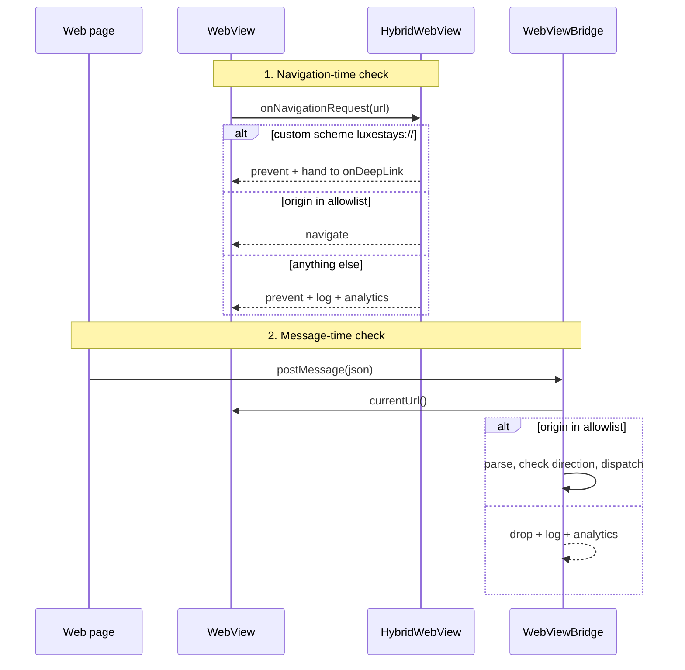
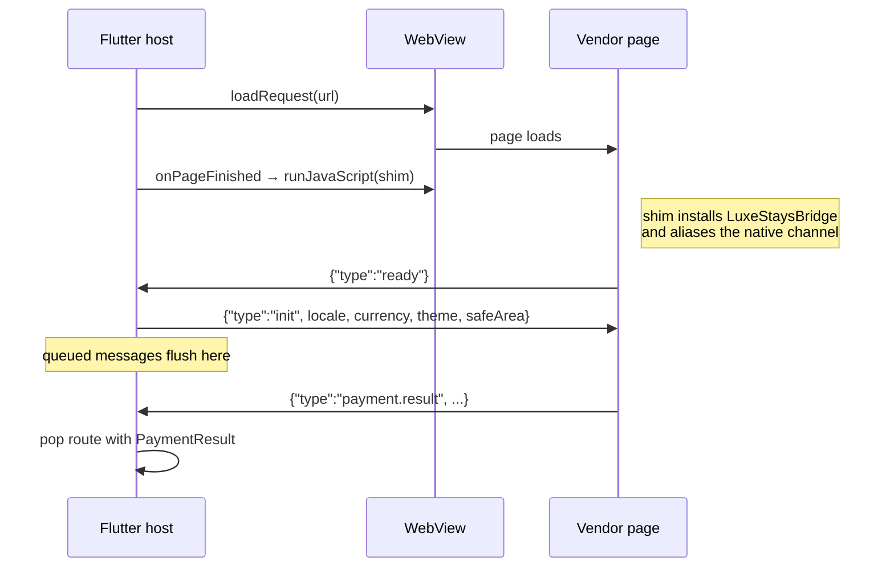

# 02 — The hybrid architecture and the WebView bridge

## Why any of the app is a WebView

"WebView-based screens" in a job description usually means one of two things: a
team that could not afford to build native, or a team that made a considered
split. This app is built as the second.

The split used here:

| Native | Web |
|---|---|
| Search, filtering, sorting | The SynXis booking-engine flow (packages, add-ons, per-property rules) |
| Hotel detail, gallery, room comparison | The PSP's hosted payment page and 3-D Secure step-up |
| Cart and multi-property basket | Legal, programme terms, destination guides, itineraries |
| Loyalty balance, tiers, redemption | |

The line is drawn by **who owns the change**:

* Anything the product team iterates on to win a booking is native — it must be
  fast, gestural, and instrumented.
* Anything a vendor or another department configures, and changes without asking
  us, is web. A property adds a spa package in SynXis on a Tuesday; legal
  rewrites a consent paragraph; the PSP adds a new SCA flow for one market. None
  of those should require an app release, a store review, or in Sabre's case a
  re-certification.

The payment page has a third reason that outweighs the other two: **PCI-DSS
scope**. If the card fields were Flutter widgets, the handset would be in scope
and every release would need re-assessment. See [11 — Security](11-SECURITY.md).

The cost of the split is that the seam becomes a contract. That contract is
this document.

## The three hybrid screens

| Screen | Loads | Returns |
|---|---|---|
| [`PaymentWebViewScreen`](../lib/webview/payment_webview_screen.dart) | PSP hosted page | `PaymentResult` |
| [`BookingEngineWebViewScreen`](../lib/webview/booking_engine_webview_screen.dart) | SynXis booking engine | `BookingEngineOutcome` |
| [`CmsContentWebViewScreen`](../lib/webview/cms_content_webview_screen.dart) | CMS page by slug | nothing |

All three are the same widget —
[`HybridWebView`](../lib/webview/hybrid_webview.dart) — with different handlers.
One WebView widget means the hard parts are solved once: allowlisting, deep-link
interception, shim injection, error state, and back-button semantics.

## Protocol

Defined in [`bridge/bridge_message.dart`](../lib/webview/bridge/bridge_message.dart).

```json
{
  "v": 1,
  "id": "web_1737550000_a3f9c1",
  "type": "payment.result",
  "replyTo": null,
  "payload": { "intentId": "pi_123", "status": "authorized" }
}
```

### Message types

| Type | Direction | Purpose |
|---|---|---|
| `ready` | web → native | Handshake. Nothing is sent to the page before this arrives. |
| `payment.result` | web → native | Terminal payment state |
| `booking.result` | web → native | Terminal booking-engine state |
| `auth.request` | web → native | The page's session expired and it wants a fresh token |
| `navigate` | web → native | The page asks the host to open a native route |
| `close` | web → native | Dismiss the screen |
| `resize` | web → native | Content height, for embedded (non-full-screen) WebViews |
| `analytics` | web → native | Forward an event so web and native funnels share one stream |
| `log` | web → native | Structured log line, surfaced in our logs |
| `error` | web → native | The page hit an error it wants us to know about |
| `init` | native → web | Locale, currency, theme, safe-area insets, session token |
| `auth.token` | native → web | Response to `auth.request` |
| `state` | native → web | Push cart/loyalty state into the page |
| `command` | native → web | Ask the page to act (`{"action":"submit"}`) |

`BridgeMessageType.isInbound` is an **allowlist**. A page that posts `init` —
pretending to be the host — is dropped, logged, and never dispatched.

### Design rules, and what each one prevents

| Rule | Prevents |
|---|---|
| Versioned (`v`) | The web team deploys on a Tuesday; the app in the field is three releases old. A newer version still parses; the host reads the fields it knows and logs the mismatch. |
| Closed enum of types | A bridge that dispatches on a method *name* supplied by the page is a remote-code-execution primitive. |
| Correlated (`id` / `replyTo`) | Request/response pairs can be matched and timed out. |
| Data only, JSON only | No native symbol is reachable from page content. |
| `tryParse` returns null, never throws | The page is untrusted input; a malformed message must not take down the host. |
| 256 KB message cap | A page that posts a megabyte of base64 in a loop cannot exhaust the host. |

## Security: origin enforcement

This is the part that is usually missing.

A `JavaScriptChannel` is registered on the **WebView**, not on a page. If the
WebView navigates anywhere — an ad redirect, an injected iframe navigation, a
compromised third-party script — that new origin can post to the same channel.
Registering the channel is therefore not the boundary. There are two checks, and
both are needed:



The allowlist is `AppConfig.webViewAllowedOrigins`, derived from the configured
base URLs — so a staging build cannot talk to production origins, and a debug
build pointed at `localhost` cannot be tricked into trusting a public host.

The second check reads the WebView's **live** URL at the moment the message
arrives, which is what makes it a real boundary rather than a comment.

## Handshake and queueing



Three details that matter in production:

* **The shim is re-injected on every `onPageFinished`.** An in-page navigation
  inside the booking engine would otherwise leave the page with no bridge, and
  the symptom — "the confirm button does nothing, but only sometimes" — is
  miserable to debug.
* **Messages sent before `ready` are queued**, so a slow page load cannot lose
  the `init` payload.
* **There is a handshake timeout** (12 s). A page that never sends `ready` must
  not leave the guest on a spinner forever.

## Escaping

Everything crossing into JavaScript is `jsonEncode`d twice — once for the
message, once to produce a safely quoted JS string literal:

```dart
final String literal = jsonEncode(message.encode());
await controller.runJavaScript(
  'window.LuxeStaysBridge && window.LuxeStaysBridge._receive($literal);',
);
```

String interpolation into `runJavaScript` is a script-injection bug waiting for
the first guest whose surname contains an apostrophe. The same rule applies
server-side: `web_pages.dart` has a `_jsString` helper that escapes quotes,
backslashes and `</` before any value reaches a `<script>` tag.

## Deep links as a fallback

Some payment providers cannot post a message — they only redirect. Every
terminal state therefore also has a `luxestays://` URL that
`onNavigationRequest` **intercepts and prevents**, so the app never actually
navigates to it:

| URL | Meaning |
|---|---|
| `luxestays://payment-success?intent=&auth=&last4=&brand=&threeds=` | Authorised |
| `luxestays://payment-failure?reason=` | Declined |
| `luxestays://payment-cancel` | Guest abandoned |
| `luxestays://booking-complete?confirmation=&hotel=&totalMinor=&currency=` | Booking engine completed |
| `luxestays://booking-cancelled` | Guest backed out |

`PaymentWebViewScreen` guards against a provider doing **both** — a
`_completed` flag means a double signal pops the route once, not twice.

You can see both paths in the mock hosted page
([`tool/mock_server/web_pages.dart`](../tool/mock_server/web_pages.dart)): it
tries the bridge first and falls back to the deep link when there is no host.

## Adding a new hybrid screen

1. Add the origin to the allowlist (i.e. add its base URL to `AppConfig`).
2. Add a message type to `BridgeMessageType` if the page needs to say something
   new — and add it to `isInbound` only if the page may originate it.
3. Compose `HybridWebView` with the handlers you need.
4. Add a case to `AppRouter.onGenerateRoute` with a typed args class.
5. Add a `bridge_message_test.dart` case pinning the new wire name. Those
   strings are a published contract with the web team; renaming one is a
   protocol version bump.

## Performance notes

WebViews are the heaviest thing this app does.

* Create the controller in `initState`, never in `build` — a rebuild would
  otherwise reload the page and lose form state.
* Keep exactly one alive at a time. Two live WebViews on a mid-range Android
  device is a visible memory and jank cost.
* Use `onProgress` for the loading bar rather than a spinner over an opaque
  overlay: on a slow connection the difference between "loading" and "frozen" is
  what stops the guest killing the app mid-payment.
* Sub-resource errors are ignored; only a main-frame failure becomes an error
  state. A failed tracking pixel is not a reason to show "we could not load this
  page".
