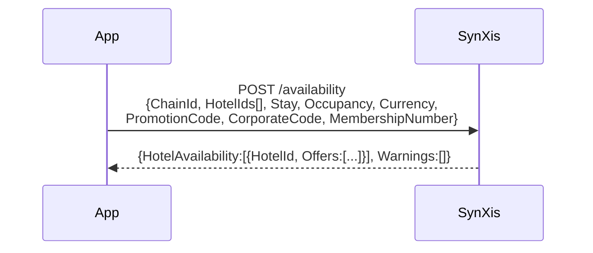
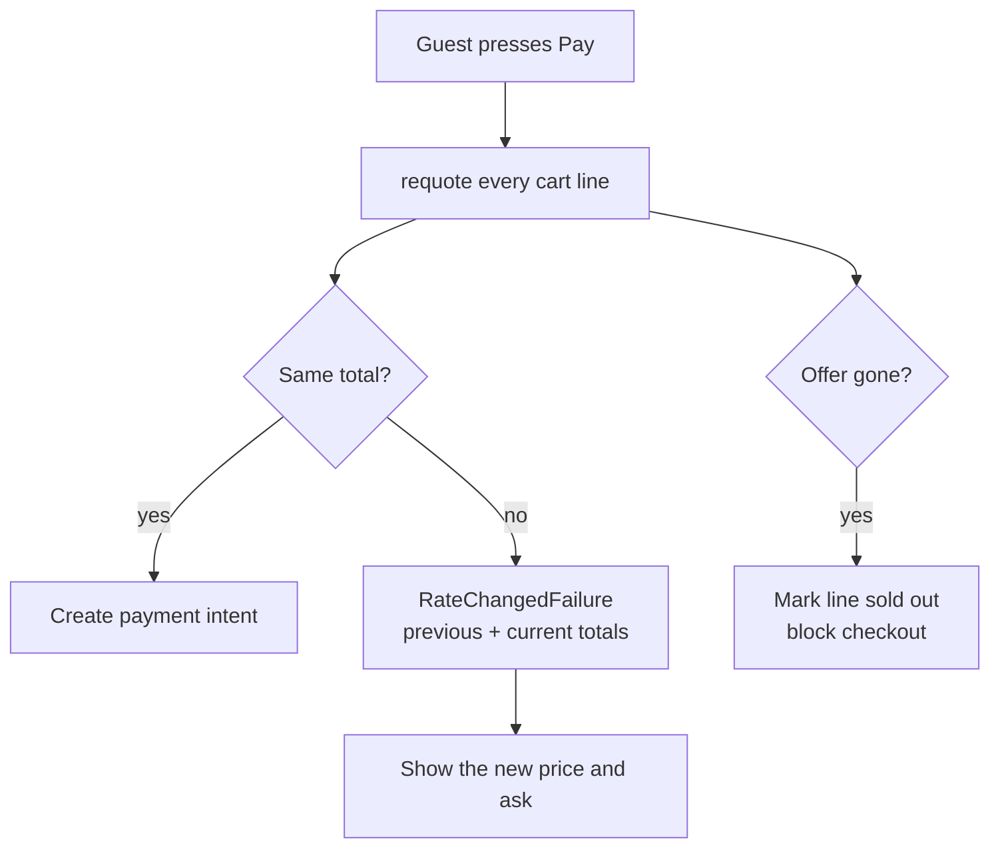
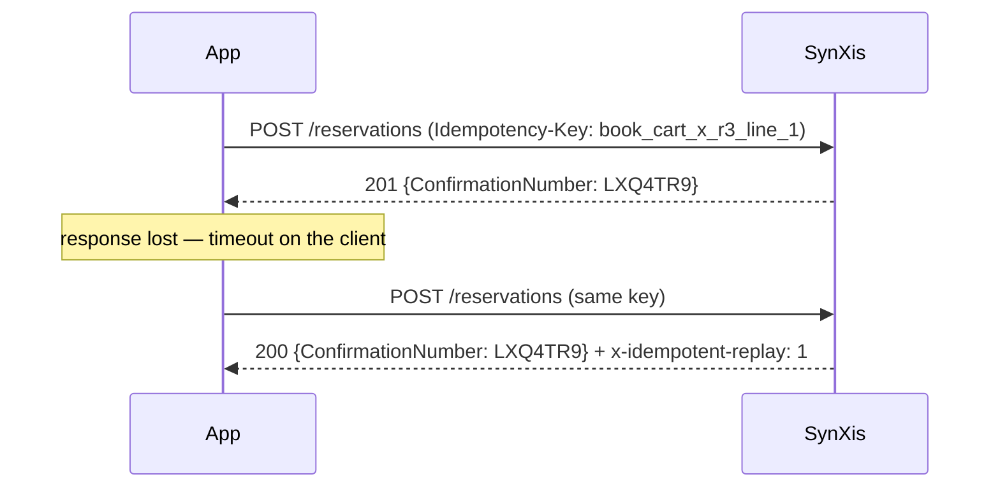

# 03 — SynXis (Sabre hospitality CRS)

## What SynXis is

**SynXis** is the hospitality platform originally built by Sabre Hospitality
Solutions. It is the **central reservation system** for tens of thousands of
hotels: it owns room inventory, rate plans, restrictions and reservations, and
it distributes them to the brand's own channels and to OTAs. The product family
includes:

| Product | What it does | Where this app touches it |
|---|---|---|
| **SynXis Central Reservations (CR)** | The CRS itself — inventory, rates, restrictions, reservations | Availability, re-quote, book, cancel |
| **SynXis Booking Engine (BE)** | The hotel's own web booking flow, configured per property | Loaded in a WebView for packages and add-ons |
| **SynXis Property Hub** | Property-management functions | Not used by the app |
| **SynXis Retailing / Enterprise Platform** | Merchandising, upsell, the REST API surface | The API layer this integration targets |

**A note on the vendor's name, as of 2026:** `sabrehospitality.com` now
redirects to **`avenhospitality.com`** — the hospitality business has been
rebranded. The SynXis product names are unchanged. Both are worth knowing about
when searching for documentation, because a great deal of it — and a great many
internal wiki pages — still say "Sabre Hospitality".

### Documentation

| Resource | URL | Access |
|---|---|---|
| Aven Hospitality (formerly Sabre Hospitality) — SynXis product family | <https://www.avenhospitality.com/> | Public |
| Sabre Dev Studio — travel APIs, SDKs and the developer portal | <https://developer.sabre.com/> | Public portal; most hotel APIs need credentials |
| SynXis REST API reference and certification materials | Issued to contracted partners through the Sabre Hospitality Central portal | **Partner only** |
| OTA (OpenTravel Alliance) message specifications, on which SynXis's semantics are based | <https://opentravel.org/> | Public |

**Be clear about what is verified here.** SynXis's REST contract is distributed
to certified partners rather than published openly. The request and response
shapes in [`synxis_models.dart`](../lib/integrations/synxis/synxis_models.dart)
are modelled on the platform's documented concepts and OTA `HotelAvail` /
`HotelResRQ` semantics — chain and hotel ids, rate plan and room type codes,
per-night rate breakdowns, quote tokens, and an `Errors` fault envelope. The
mock server matches them exactly. **Swapping in the real contract means editing
the DTOs and the mapper, and nothing above them.** That is the point of the
layering: the integration is built against the platform's documented shape, and
the seam where a real contract drops in is a single file per vendor.

## What the app calls

[`synxis_api.dart`](../lib/integrations/synxis/synxis_api.dart)

| Method | Endpoint | Notes |
|---|---|---|
| `searchHotels` | `GET /v1/api/hotels` | The chain directory. Cheap, cacheable, prices nothing. |
| `availability` | `POST /v1/api/availability` | The expensive one. POST because it carries child ages and rate-access codes, and because the CRS treats shopping as a transaction rather than a cacheable resource. |
| `requote` | `POST /v1/api/availability/requote` | Re-price a single offer immediately before payment. |
| `createReservation` | `POST /v1/api/reservations` | Always carries an `Idempotency-Key`. |
| `reservation` | `GET /v1/api/reservations/{confirmation}` | Retrieve by confirmation number + surname. |
| `cancelReservation` | `POST /v1/api/reservations/{confirmation}/cancel` | |
| `roomTypes` | `GET /v1/api/hotels/{hotelId}/rooms` | Descriptions, bedding, occupancy limits. |

## Availability: the request that costs money



Four things in that request are easy to get wrong:

* **Child ages, not a child count.** Hotels price children by age band. A
  request with `Children: 2` and no ages is rejected, or worse, silently priced
  as adults.
* **`MembershipNumber` is what unlocks member rate plans.** Sending it is the
  entire mechanism behind "sign in to see lower rates". Without it the CRS
  simply does not return those plans.
* **`Currency` is a display request, not a conversion.** The CRS quotes in the
  property's currency; asking for another is a request for the CRS's own
  conversion, and mixing the two in one cart is how you get a total that does
  not reconcile.
* **`Warnings` come back on a 200.** SynXis will happily return success while
  quietly telling you it hid a restricted rate. The repository logs them; a
  production build should alert on them, because "why is this rate missing"
  investigations start here.

### Nightly rates, not an average

The response carries one amount per in-house night. `RoomOffer` keeps them in a
`Map<DateTime, Money>` and derives the average for display. Showing an average
as if it were a nightly rate is a chargeback waiting to happen when a stay spans
a weekend uplift — the mock server applies an 18% Friday/Saturday uplift
specifically so this is visible while developing.

### Caching

`SynxisRepository` memoises availability for 5 minutes keyed by
`SearchQuery.cacheKey` + sorted hotel ids + membership number. Filters and sort
are applied **client-side over the cached response**, so moving a price slider
does not cost another shop request. Filters that genuinely change what the CRS
returns — promotion code, corporate code, member access — force a refresh.

## Re-quote: the most important unhappy path

Hotel pricing is perishable. Between the guest seeing a price and pressing
*Pay*, the rate can move, the room can sell, or the restriction can change.



`SynxisRepository.revalidate` returns a `RateChangedFailure` carrying **both**
totals rather than silently accepting the new price. That is a product decision,
not a technical one: the guest must confirm any change before we take their
money.

An offer with no `QuoteToken` is treated as stale rather than trusted — it means
the offer came from a cached search that predates a contract change.

To exercise the path locally, send `x-mock-rate-change: 1` (see
[13 — Runbook](13-RUNBOOK.md)).

## Idempotency: why a retry cannot double-book

`createReservation` always carries `Idempotency-Key:
book_{cartId}_r{revision}_{lineId}`, derived from the cart's identity and its
mutation counter.



This is also what makes `RetryInterceptor` safe: it retries GET and HEAD
unconditionally, and everything else **only** when an `Idempotency-Key` header
is present. Without that rule, an automatic retry on a POST is a double-booking
machine.

`Cart.revision` increments on every mutation, so a guest who changes their cart
and retries gets a genuinely new booking rather than a replay of the old one.

The mock server implements the replay behaviour, and
`tool/contract_check.sh` asserts it.

## The booking engine WebView

[`synxis_booking_engine.dart`](../lib/integrations/synxis/synxis_booking_engine.dart)
builds the URL:

```
{BE base}?chain=12345&hotel=H-PAR-001
        &arrive=2026-11-12&depart=2026-11-14
        &adult=2&rooms=1&childages=6
        &currency=EUR&locale=en-US
        &room=DLX&rate=BARBB
        &promo=STAY4&member=LS-100042
        &embedded=true&returnUrl=luxestays://booking-complete
```

`embedded=true` tells the web layer it is inside the app, so it renders without
its own chrome and enables the bridge handshake. Terminal states come back over
the bridge, with `luxestays://` deep links as a fallback — see
[02 — WebView bridge](02-WEBVIEW-BRIDGE.md).

## Authentication, and where the secret lives

SynXis issues OAuth client credentials to a **certified partner integration**.
Those credentials must never ship in an app binary — an APK is a zip file, and
`strings` is free.

The pattern here: the handset authenticates to **our own BFF**, and the BFF
holds the SynXis client secret and mints a short-lived, narrowly-scoped token
for the device. `AppConfig.synxisBaseUrl` therefore points at the BFF in
production, and the client code is identical either way. See
[11 — Security](11-SECURITY.md).

## Error handling

`ErrorMapper.synxis()` reads `{"Errors":[{"Code","Message"}]}` and maps:

| Condition | Failure | UI behaviour |
|---|---|---|
| 409 / `HOTEL_NOT_AVAILABLE` | `ClientFailure` | "That room is no longer available" — no retry button |
| `RATE_CHANGED` / `PRICE_MISMATCH` | `RateChangedFailure` | Show both prices, ask the guest |
| 429 | `RateLimitFailure` (honours `Retry-After`) | Retry with backoff, then a soft message |
| 5xx | `ServerFailure` | Retryable; retry button shown |
| Timeout | `NetworkFailure` | Retryable |
| Schema drift | `ContractFailure` naming the field | Alert-worthy: a vendor changed something |

## If this were production

* Move from a static `chainId` to per-brand configuration — a 400-property
  portfolio across 75 countries is rarely one chain code.
* Add restriction awareness (minimum length of stay, closed-to-arrival) so the
  UI explains *why* a date is unavailable instead of showing an empty list.
* Persist the availability cache with an ETag so a cold start does not re-shop.
* Push the availability fan-out into the BFF: one mobile request instead of
  twenty, and CRS credentials that never leave the server.
