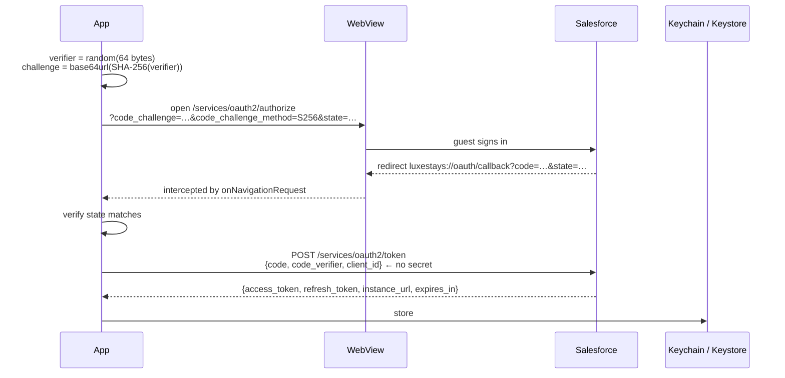
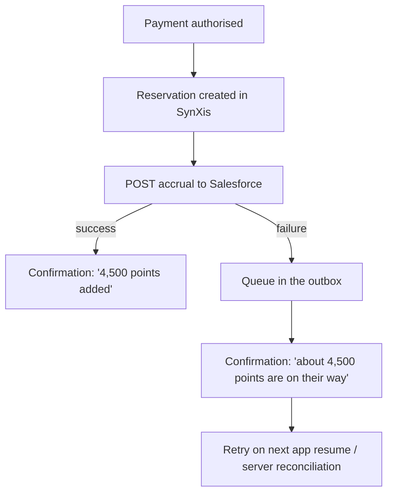

> Contract audit (2026-09-14): read [15-API-AUDIT.md](15-API-AUDIT.md) first. Vendor-shaped examples below describe the demo gateway, not certified production contracts. Payment/compliance statements are design intentions, not certifications.

# 04 — Salesforce (CRM, Loyalty Management, Service Cloud)

## What Salesforce does in this product

Three distinct capabilities, all reached over the same REST base
(`/services/data/{version}/…`):

| Capability | Owns | Used for |
|---|---|---|
| **Loyalty Management** | Members, tiers, point balances, vouchers, accrual and redemption processes | The whole rewards experience |
| **Platform REST / SOQL** | Everything else in the org | Reading the points ledger |
| **Service Cloud** | Cases | In-app "Need help?" with the failing request's correlation id attached |
| *(Marketing Cloud)* | Push, in-app and inbox messaging | Out of scope here; the seam is `AnalyticsService` |

Salesforce is the **system of record for loyalty**. The client never computes an
authoritative balance. `LoyaltyProgramRules` exists only to render honest
previews ("you'll earn about 4,500 points") before the accrual is actually
posted — and every such number is labelled as an estimate in the UI.

### Documentation

| Resource | URL |
|---|---|
| Loyalty Management developer guide (data model, standard objects) | <https://developer.salesforce.com/docs/atlas.en-us.loyalty.meta/loyalty/> |
| REST API developer guide (`/services/data`, SOQL, sObjects) | <https://developer.salesforce.com/docs/atlas.en-us.api_rest.meta/api_rest/> |
| Connect REST API developer guide | <https://developer.salesforce.com/docs/atlas.en-us.chatterapi.meta/chatterapi/> |
| OAuth 2.0 authorisation flows | <https://help.salesforce.com/s/articleView?id=sf.remoteaccess_oauth_flows.htm> |
| MobilePush SDK (push, in-app, inbox — Flutter supported) | <https://developer.salesforce.com/docs/marketing/mobilepush/guide/overview.html> |
| API version support and retirement policy | <https://developer.salesforce.com/docs/atlas.en-us.api_rest.meta/api_rest/dome_versions.htm> |

The loyalty resource paths used here follow the documented Connect REST API
shape for Loyalty Management (`/connect/loyalty/programs/{program}/…`). Confirm
the exact paths against the guide above for the API version your org runs, and
against your org's own program-process names — those are configured by the
loyalty team, not fixed by Salesforce.

## Authentication: Authorization Code with PKCE

Salesforce offers several OAuth flows. For a **public mobile client** only one
is defensible.

| Flow | Verdict |
|---|---|
| JWT bearer | Requires a private key in the binary. No. |
| Username-password | Ships a password. No. |
| Implicit | Leaks the token through the redirect. Deprecated. No. |
| **Authorization Code + PKCE** | No client secret needed. **Yes.** |
| Device flow | Fine for TVs; poor UX on a phone. |



Implementation:
[`salesforce_auth.dart`](../lib/integrations/salesforce/salesforce_auth.dart).
The verifier never leaves the device; only its SHA-256 hash travels in the
authorize URL. `prompt=login` forces the account chooser rather than silently
reusing a session belonging to somebody else on a shared device.

**`instance_url` matters.** Salesforce returns the org's own host with the
token; subsequent requests must go there, not to `login.salesforce.com`.
`AuthInterceptor` carries it through on `options.extra`.

### Token refresh is single-flight

`AuthInterceptor` extends `QueuedInterceptor`, not `Interceptor`. Dio processes
queued interceptors one request at a time, so ten parallel calls that all hit an
expired token trigger **one** refresh. Without that you get the classic
refresh-token stampede where concurrent rotations invalidate each other and the
guest is signed out at random.

Tokens are treated as expired 60 seconds early, so a request never dies
in flight. On a 401 the interceptor refreshes **once** and replays; a second
failure clears the token and signals "signed out". Storage is
`flutter_secure_storage` — Keychain on iOS
(`first_unlock_this_device`), EncryptedSharedPreferences on Android.

### The safer production variant

Even PKCE leaves the app talking directly to Salesforce. The pattern this
architecture recommends is that the handset authenticates to **our BFF**, and
the BFF holds the connected-app credentials and brokers Salesforce access. The
client code is unchanged — only `loginBaseUrl` moves. That also lets the BFF
enforce per-user rate limits, which matters because Salesforce API limits are
org-wide and a mobile fleet can exhaust them.

## Loyalty Management

[`salesforce_api.dart`](../lib/integrations/salesforce/salesforce_api.dart)

| Operation | Resource |
|---|---|
| Member by membership number | `GET /connect/loyalty/programs/{program}/members?membershipNumber=` |
| Member by id | `GET /connect/loyalty/programs/{program}/members/{memberId}` |
| Vouchers | `GET /connect/loyalty/programs/{program}/members/{memberId}/vouchers` |
| Points ledger | `GET /services/data/{v}/query?q=SELECT … FROM LoyaltyLedger …` |
| Accrual | `POST /connect/loyalty/programs/{program}/program-processes/AccrueStayPoints` |
| Redemption | `POST /connect/loyalty/programs/{program}/program-processes/RedeemPointsForVoucher` |
| Enrolment | `POST /connect/loyalty/programs/{program}/individual-member-enrollments` |
| Support case | `POST /services/data/{v}/sobjects/Case` |

### Program processes, not direct writes

Accrual runs a **Loyalty Program Process** rather than inserting a ledger row.
That is where the business configures earn rates, tier multipliers and promotion
stacking — and it is owned by the loyalty team inside Salesforce, not by mobile
engineering.

The division of responsibility:

> **The app supplies facts** — eligible spend, nights, property, channel, date.
> **Salesforce decides the points.**

Which means a promotion change ("double points in Kyoto this March") ships from
Salesforce with no app release. That is the entire reason not to compute
accruals on the client.

Every point movement produces a **`TransactionJournal`** record. That is the
audit trail finance reconciles against a booking, which is why
`SalesforceProcessResult` surfaces `transactionJournalId`.

### Loyalty must never fail a booking

This is the most consequential decision in the integration.



By the time points are posted, the reservation exists and the guest has been
charged. Blocking the confirmation screen on a CRM write would trade a real
revenue event for a cosmetic one. `SalesforceRepository.postAccrual` **never
throws**: on failure it queues a `DeferredAccrual` and returns a clearly-labelled
local estimate.

The retry is safe because every accrual carries
`Idempotency-Key: accrual_{confirmationNumber}` — a duplicate post is a no-op
server side.

*In production the outbox is persisted and drained by a background worker
(WorkManager / BGTaskScheduler), with a nightly server-side reconciliation as
the backstop. Here it is in-memory and drained by `retryDeferredAccruals()`.*

### Graceful degradation on read

`memberView` fetches the profile, then vouchers and ledger **in parallel**. The
profile is required; the other two are best-effort:

```dart
final voucherFuture = _api.vouchers(dto.memberId);
final ledgerFuture  = _api.ledger(dto.memberId);
final voucherResult = await voucherFuture;
final ledgerResult  = await ledgerFuture;
```

A loyalty screen that shows a balance with an empty history is far better than
one that shows an error because a secondary call timed out. `LoyaltyMemberView`
carries `ledgerAvailable` / `vouchersAvailable` so the UI can say so.

### SOQL, and injection

The ledger is read with SOQL because it is exactly the "last 50 rows ordered by
date" query the Connect resources do not expose. The only interpolated value is
a Salesforce 18-character record id that came from Salesforce itself — never
free guest input. Anything guest-supplied would be escaped in the BFF rather
than on the client. It is worth saying out loud, because a SOQL string built
from a search box is a real vulnerability class.

## Error handling

Salesforce returns errors as a JSON **array**:

```json
[{"errorCode": "INSUFFICIENT_POINTS", "message": "…"}]
```

`ErrorMapper.salesforce()` handles both that and the object shape used by the
OAuth endpoints (`error` / `error_description`). `INVALID_SESSION_ID` arrives as
a 401 and becomes an `AuthFailure`, which is what triggers the refresh path.

## Version pinning

`AppConfig.salesforceApiVersion` pins `v62.0`. Salesforce ships three releases a
year and retires old versions slowly; pinning rather than following "latest" is
what stops a Salesforce release weekend from breaking an app binary that is
already in the field. Bumping it is a deliberate, tested change.

## If this were production

* Marketing Cloud **MobilePush** for push, in-app and inbox messaging, behind
  the existing `AnalyticsService` seam.
* Consent (`marketingOptIn`) written to the contact record on booking, with an
  audit trail — it is captured here and deliberately never defaulted to true.
* Einstein / Data Cloud segments to drive personalised offers, joined to the CMS
  offer entries by promotion code.
* A BFF-side circuit breaker on the loyalty endpoints, so a Salesforce incident
  degrades the rewards UI instead of slowing every checkout.
