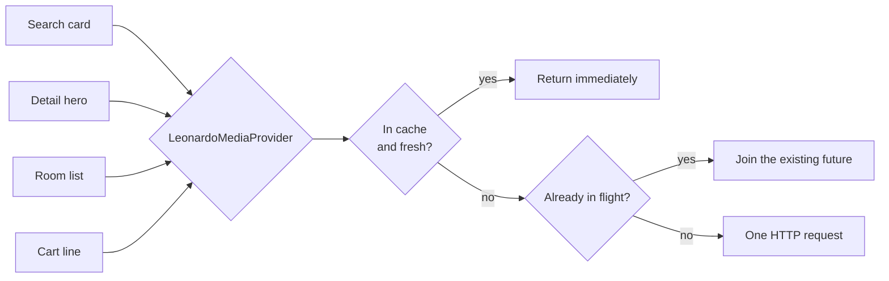

> Contract audit (2026-09-14): read [15-API-AUDIT.md](15-API-AUDIT.md) first. Vendor-shaped examples below describe the demo gateway, not certified production contracts. Payment/compliance statements are design intentions, not certifications.

# 05 — Leonardo (hotel media) and Leonardo.Ai

## Two different companies, similar names

"Leonardo" in a hospitality context almost always means the first of these.
This project wires up both, behind one interface, because the distinction is
easy to get wrong — and because doing so demonstrates the point the
architecture is making.

| | **Leonardo (Leonardo Worldwide)** | **Leonardo.Ai** |
|---|---|---|
| What it is | The hospitality visual-content platform — hotels manage and syndicate their photography through it | A generative image API |
| Products | **LUCID Content Manager**, LUCID Media Library, Content Feeds, PropertyVIEW, hotel websites | REST generation API, models, image guidance |
| Scale | Used by tens of thousands of hotels, distributing to 450+ travel channels | General-purpose |
| Site | <https://www.vizlly.com/> | <https://leonardo.ai/> |
| Docs | Partner-provisioned (per chain, under agreement) | <https://docs.leonardo.ai/> |
| Role here | **System of record for photography** | Destination mood imagery only |
| Code | [`leonardo_client.dart`](../lib/integrations/leonardo/leonardo_client.dart) | [`leonardo_ai_client.dart`](../lib/integrations/leonardo/leonardo_ai_client.dart) |

## Why a media platform is its own system

In the LuxeStays architecture Leonardo is the system of record for pictures, in
exactly the way SynXis is for inventory and the CMS is for words.

A property's marketing team re-shoots the lobby, re-crops the hero, retires an
image whose licence lapsed. None of that should involve an engineer, a CMS
editor, or an app release. The app asks for "the approved media for property
H-PAR-001" and renders whatever comes back.

The join key is the **CRS hotel id** — the same id SynXis uses and the same id
the CMS entry carries. Media is matched to room types by **room type code**
(`DLX`, `JRSTE`, `STE`), which is what lets a room card show the right room.

**What is verified here:** Leonardo's media APIs and content feeds are
provisioned per chain under a partner agreement rather than published openly.
The shapes in `leonardo_client.dart` are modelled on their documented concepts —
asset id, category, caption, credit, rendition URLs, room-type association,
licence window — and the mock server matches them. Everything vendor-specific
lives in that one file plus `LeonardoUrlBuilder`.

## The `MediaProvider` seam

Widgets never see a Leonardo type. They depend on
[`MediaProvider`](../lib/integrations/leonardo/media_provider.dart):

```dart
abstract interface class MediaProvider {
  Future<Result<List<MediaAsset>>> galleryFor(String hotelId);
  Future<Result<List<MediaAsset>>> roomMedia({required String hotelId, required String roomTypeCode});
  String urlFor(MediaAsset asset, MediaTransform transform);
}
```

`urlFor` is **synchronous and pure**, because it is called from `build()` on
every image. An implementation that touched the network there would jank the
list.

Two implementations ship: `LeonardoMediaProvider` (production) and
`StaticMediaProvider` (tests, previews, offline mode). Overriding one provider
is what lets the entire widget test suite run with no network at all — see
[`test/widgets/hotel_card_test.dart`](../test/widgets/hotel_card_test.dart).

## Renditions: the bandwidth story

The app never hard-codes a CDN path. It holds a `MediaAsset` and asks for the
rendition the widget actually needs:

```dart
MediaTransform.thumbnail  // 320 × 214, q70
MediaTransform.card       // 720 × 480, q78
MediaTransform.hero       // 1440 × 900, q82
```

`MediaImage` then scales by the device pixel ratio (capped at 2048 px, so a 3×
phone never asks for a 4320-pixel-wide JPEG) and passes the result to both the
URL builder and `memCacheWidth`.

That second part matters more than it looks. A 4000-pixel master decodes to
roughly **64 MB of RAM** regardless of how small you draw it. Capping the
*decode* — not just the request — is what keeps a scrolling gallery from
triggering the image cache's eviction thrash on a mid-range Android device.

`LeonardoUrlBuilder` centralises the query syntax (`w`, `h`, `q`, `fmt`, `fit`).
The day the CDN renames a parameter, exactly one file changes and every
`MediaTransform` preset keeps working. The mock server echoes the served size in
an `x-rendition` response header so you can verify it while developing.

## Caching and request coalescing



Four widgets ask for the same property's gallery within a second of each other.
Without coalescing that is four round trips for one screen. `_inFlight` maps
hotel id → future; `_galleryCache` holds the result for 30 minutes.

Only the first `galleryPrefetchCount` (12) results have their imagery
prefetched. Beyond the fold there is no point paying for the round trip until
the guest scrolls.

## Licences expire

`LeonardoAssetDto.licenceExpiresAt` is filtered client-side as well as
server-side, and the provider logs how many assets it dropped. Shipping an
expired-licence image in a booking flow is a legal problem, not a cosmetic one,
and belt-and-braces here is cheap. The mock server always returns one lapsed
asset per property so the filter is exercised on every run.

## Ordering

The gallery is sorted hero-first, then by a fixed category order (exterior →
lobby → rooms → suites → dining → spa → pool). Deterministic ordering means the
gallery does not reshuffle between launches, which reads as instability even
when nothing is wrong.

## Leonardo.Ai: where generative imagery is and is not acceptable

`LeonardoAiClient` calls the public generation API
(`POST /generations`, then poll `GET /generations/{id}` — generation is
asynchronous, so the client submits, polls at 2 s intervals, and gives up at
45 s rather than spinning forever).

The rules this app applies:

* **Never for a room, a property or an amenity.** A guest booking a
  1,200-a-night suite must see that suite. Anything else is misrepresentation.
* **Destination and inspiration surfaces only**, where the image is evocative
  rather than evidential.
* **Always labelled.** Every generated asset is tagged
  `MediaSource.leonardoAi`, and `MediaImage` renders a visible "AI impression"
  badge. That is a product requirement, not a nicety.
* **Never blocking.** `destinationImagery()` returns an empty list on any
  failure; inspiration content must not break a screen.

### The API key does not go in the app

Leonardo.Ai's own documentation is explicit that the key must not be embedded
client-side, and generation is billed per credit — a key extracted from an APK
is somebody else's GPU budget. `LeonardoAiClient` therefore points at our BFF by
default, which holds the key and enforces per-user quotas. Pointing it straight
at `cloud.leonardo.ai` is supported only for local experimentation.

## If this were production

* Signed, expiring rendition URLs, so a scraped URL stops working.
* `precacheImage` for the next screen's hero during the search-results idle
  moment — a detail page that opens with its image already resolved feels
  twice as fast.
* A blur-hash or dominant-colour placeholder per asset, delivered in the media
  response, instead of a grey box.
* `AVIF` where the platform supports it: another 20–30% off an image-heavy
  browse session.
* Bandwidth budgets per screen, measured in CI, so a designer's "let's make the
  hero full-bleed" is a number rather than an argument.
