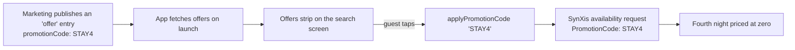

# 06 — The headless CMS

## What the CMS owns

Words, campaigns and legal copy — everything the brand says, as opposed to
everything the CRS can sell.

| Content type | Fields | Where it appears |
|---|---|---|
| `hotelContent` | `hotelId`, `headline`, `body`, `signatureExperience`, `neighbourhood`, `amenities[]`, `highlights[]`, `tags[]`, `heroImage`, `locale` | Search cards, hotel detail |
| `offer` | `title`, `subtitle`, `promotionCode`, `memberOnly`, `hotelIds[]`, `image`, `termsUrl`, `startsAt`, `endsAt` | The offers strip on search |
| `page` | `slug`, `title`, `url` | Terms, programme rules, itineraries — rendered in a WebView |

The join key is `hotelId` — the **CRS** hotel id. Content and inventory are
matched on it, never on the hotel's name. Names are not stable, are not unique
across a 75-country portfolio, and get re-branded.

## Reference implementation: Contentful

The client is written against the **Contentful Content Delivery API** shape,
because its envelope — `items` + `includes` + `Link` references — is what
almost every headless CMS converged on (Strapi, Sanity, Storyblok and Kontent
all do a version of it). Porting to another CMS means rewriting
[`cms_models.dart`](../lib/integrations/cms/cms_models.dart) and nothing else.

| Resource | URL |
|---|---|
| Content Delivery API reference | <https://www.contentful.com/developers/docs/references/content-delivery-api/> |
| Content model and content types | <https://www.contentful.com/developers/docs/concepts/data-model/> |
| Images API (transformations) | <https://www.contentful.com/developers/docs/references/images-api/> |
| Search parameters (`[in]`, `include`, `order`) | <https://www.contentful.com/developers/docs/references/content-delivery-api/#/reference/search-parameters> |

Base URL `https://cdn.contentful.com`, path
`/spaces/{space}/environments/{env}/entries`, bearer **delivery** token.

## The link-resolution trap

This is the bug every team hits in its first week with a headless CMS.

A CDA response does **not** inline referenced entries and assets. It returns
placeholders and ships the real records alongside:

```json
{
  "items": [{
    "sys": { "id": "entry-H-PAR-001" },
    "fields": {
      "hotelId": "H-PAR-001",
      "heroImage": { "sys": { "type": "Link", "linkType": "Asset", "id": "asset-1" } }
    }
  }],
  "includes": {
    "Asset": [{
      "sys": { "id": "asset-1" },
      "fields": { "file": { "url": "//images.example.com/hero.png" } }
    }]
  }
}
```

Read `fields.heroImage.fields.file.url` naively and you get `null`. The symptom
is a screen full of grey placeholders that nobody can explain, because the API
returned 200 and the data "looks fine" in the debugger.

`ContentfulResponse.resolveLinks` walks the tree and substitutes. Three details
that are easy to miss:

* **Depth-limited.** A CMS graph can be cyclic (hotel → related offer → hotel).
  An unbounded resolver on the main isolate is a hang, not a bug report.
* **An unresolvable link returns `null`, not an exception.** In practice it
  means the entry is published and the thing it references is not — a state
  content editors cannot see, and which must degrade rather than crash.
* **Asset URLs are protocol-relative** (`//images…`). `CmsHotelContent._assetUrl`
  normalises them to `https:`.

All three are pinned by
[`test/integrations/cms_links_test.dart`](../test/integrations/cms_links_test.dart).

## Content is never load-bearing

The governing rule of `CmsRepository`: **every method degrades to an empty
result rather than propagating a failure.**

```dart
Future<Map<String, CmsHotelContent>> hotelContent(List<String> hotelIds) async {
  // …
  result.fold(
    (content) => cacheAndReturn(content),
    (failure) => _logger.warn('cms unavailable, rendering CRS data only'),
  );
  return _subsetOf(hotelIds);
}
```

A missing marketing paragraph must not stop a guest booking a room. The failure
is logged and would be alerted on; the funnel stays open.

Contrast with `SynxisRepository`, where a failure genuinely must surface — if
the CRS is down, there is nothing to sell.

This is visible in the product: one property in the fixtures
(`H-CPT-002`) deliberately has **no** CMS entry, so every run of the app
exercises the no-content path. Its card renders without a headline and is fully
bookable.

## Batching

A search page holds twenty properties. Twenty sequential CMS calls is the
difference between a list that renders in 300 ms and one that trickles in over
four seconds. `CmsClient.hotelContent` batches with
`fields.hotelId[in]=H-1,H-2,…` and `include=2` (depth enough to pull the hero
asset and any nested reference in one hop).

Results are cached for 15 minutes, and only the ids not already cached are
requested.

## Campaigns without a release

The clearest demonstration of why a CMS is in the stack at all:



No release. No store review. No engineer. `memberOnly` entries are filtered
client-side against the session, so a campaign can be aimed at Rewards members
only — and the mock server's `STAY4` really does zero out the fourth night, so
the whole loop is visible locally.

## Legal copy in a WebView

`page` entries resolve to a URL that `CmsContentWebViewScreen` loads. Rendering
CMS rich text natively means owning a rich-text renderer, an image-embed
strategy, table layout and a per-locale typography pass. For content the app
only *displays* — and never reasons about — the web page is cheaper and more
faithful to what the author previewed.

Structured content the app *does* reason about (hotel descriptions, amenity
lists, offer codes) comes through as data. The line is: **if the app needs to
filter, sort or price on it, it is data; if it only needs to show it, it is a
page.**

Those pages can talk back — the mock page posts a `navigate` message — but the
host checks the requested route against an allowlist. A CMS page cannot push
arbitrary routes into the app.

## Tokens

The **delivery** token is read-only, scoped to one space and environment, and
grants access only to published content. It is safe to ship in the binary. The
**management** token can write, and never leaves the server. That is why
`cmsClientProvider` has no `AuthInterceptor`: there is no user identity and
nothing to refresh.

## If this were production

* Locale plumbing end to end: the CDA `locale` parameter is already passed, but
  the app's own strings need `intl` and ARB files.
* Preview API behind a debug flag, so content editors can see unpublished work
  in a real build.
* A webhook from the CMS to a push topic, to invalidate the 15-minute cache when
  something changes urgently (a corrected price disclaimer, say).
* Asset URLs through Contentful's Images API (`?w=&h=&fm=webp&q=`) for the few
  images the CMS owns, mirroring what `LeonardoUrlBuilder` does for property
  photography.
