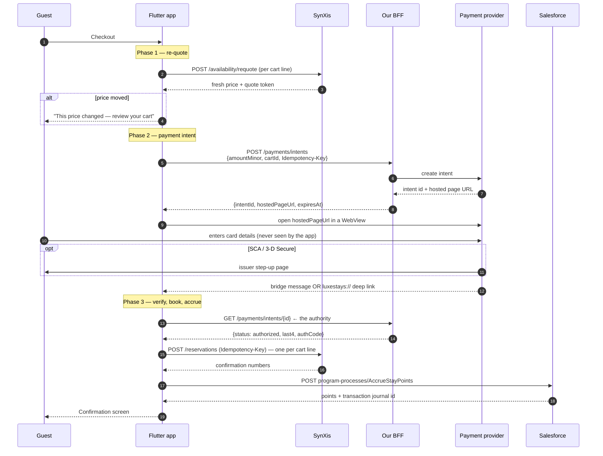

> Contract audit (2026-09-14): read [15-API-AUDIT.md](15-API-AUDIT.md) first. Vendor-shaped examples below describe the demo gateway, not certified production contracts. Payment/compliance statements are design intentions, not certifications.

# 07 — The booking and payment flow

The most consequential path in the app. Everything else can be retried; this one
moves money.

## The whole sequence



Code: [`BookingRepository`](../lib/data/booking_repository.dart) owns the
sequence, [`CheckoutController`](../lib/features/booking/checkout_controller.dart)
drives it, [`PaymentWebViewScreen`](../lib/webview/payment_webview_screen.dart)
owns the middle step.

## Why three phases with a WebView in the middle

Because the middle step does not belong to us. The controller cannot `await`
across it; the flow has to be resumable from whatever the WebView hands back.
Splitting it explicitly means every step is unit-testable with a fake
repository, and the only part needing a widget test is the hand-off itself.

## Phase 1 — re-quote

Hotel pricing is perishable. Booking against a quote the guest saw twenty
minutes ago is how you get a price-mismatch chargeback.

`prepare()` re-quotes every line and returns a `CheckoutPreparation` with
per-line problems. A `RateChangedFailure` carries both the previous and the
current total, so the UI can say exactly what moved rather than "something went
wrong". Lines that are gone are marked `soldOut` and block checkout.

## Phase 2 — the payment intent

The app's entire involvement with money:

1. ask the BFF to create an intent for an amount;
2. open the returned hosted page in a WebView;
3. receive a result and hand the **intent id** to SynXis.

It never sees, stores, transmits or processes card data. That single fact keeps
the mobile app at PCI-DSS **SAQ-A** rather than SAQ-A-EP — see
[11 — Security](11-SECURITY.md).

The intent request carries `Idempotency-Key: book_{cartId}_r{revision}`, so a
retry after a timeout cannot create two intents for the same basket.

## Phase 3 — never trust the WebView

```dart
// 3a. Confirm with the PSP, server side.
final verified = await _payments.verifyIntent(bridgeResult.intentId);
```

The bridge result is a **hint**. A hostile or broken page could post
`{"status":"authorized"}` without any money moving. Before any reservation is
created, the status is confirmed server-to-server. The bridge message exists to
make the UI responsive, not to be believed.

The app logs when the two disagree — a bridge claiming success against a
verification saying otherwise is either a bug in the vendor page or an attack,
and both are worth an alert.

## Failure modes, in order of how much they matter

| # | Failure | What happens | Guest sees |
|---|---|---|---|
| 1 | **Payment authorised, no reservation created** | The unacceptable one. Payment is *authorised*, not captured; on total booking failure the BFF is signalled to void. | "We could not confirm your booking and your card has not been charged." |
| 2 | Price moved between phase 1 and phase 3 | Flow stops before payment | The new price, with a confirm step |
| 3 | Partial booking (2 of 3 lines) | Confirmed lines are kept; failures are listed by name | "Some of your rooms are confirmed", with the failures itemised |
| 4 | Reservation made, loyalty post failed | Booking stands; accrual queued in the outbox | "About 4,500 points are on their way" |
| 5 | Guest abandons the WebView | Intent left unconfirmed; expires at the PSP | Returns to checkout, cart intact |
| 6 | Route popped with no result | Treated as an abandoned payment, not a success | Same as 5 |
| 7 | PSP declines | No reservation attempted | The decline reason from the PSP |
| 8 | Hosted page fails to load | Treated as a failed payment | "The payment page could not be loaded." |

Numbers 3 and 4 are the ones most implementations get wrong. Both are *partial
successes*, and telling the guest the truth about them is cheaper than the
support contact that follows a confirmation screen which quietly overstated
things. `ConfirmationScreen` renders both states explicitly.

## Idempotency across the whole flow

| Operation | Key |
|---|---|
| Payment intent | `book_{cartId}_r{revision}` |
| Reservation (per line) | `book_{cartId}_r{revision}_{lineId}` |
| Loyalty accrual | `accrual_{confirmationNumber}` |
| Loyalty redemption | `redeem_{cartId}_{points}` |
| Cancellation | `cancel_{confirmationNumber}` |

`Cart.revision` increments on every mutation, so a changed basket produces
genuinely new keys while an unchanged one replays safely. This is what makes
`RetryInterceptor` safe on non-idempotent methods: it retries a POST **only**
when an `Idempotency-Key` header is present.

## Points and eligible spend

Points are earned on **room revenue, not on tax and fees**
(`LoyaltyProgramRules.taxesEarnPoints` defaults to false). Getting this wrong is
the single most common loyalty support ticket, because guests check the maths.

Redemption is separate from booking on purpose: burning points issues a
Salesforce **voucher**, which is a real record with its own lifecycle. If the
booking later fails, the voucher still exists and can be used again — the guest
does not lose their points to our error.

## Trying it locally

```bash
dart run tool/mock_server/server.dart
make run
```

1. Search, add a room, open the cart, sign in as `LS-100042`, redeem points.
2. Checkout, fill in the guest details, press **Pay**.
3. The hosted page opens in a WebView. It has three buttons — authorise,
   simulate a decline, cancel — and roughly half the time it will show a stub
   3-D Secure step-up first.
4. The confirmation screen shows the SynXis confirmation number and the points
   Salesforce actually posted.

To exercise the unhappy paths, see [13 — Runbook](13-RUNBOOK.md): a
`x-mock-rate-change` header forces a price move, `--fail-rate` injects vendor
failures, and `--latency` makes the timeout and spinner behaviour observable.
