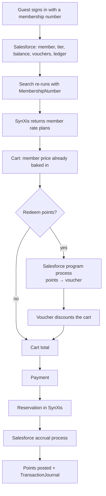

# 08 — Loyalty: member rates plus points

The brief calls for "loyalty programmes that combine hotel discounts with an
internal points-based rewards system". Those are two different mechanics with
two different owners, and conflating them is a common design mistake.

| Mechanic | Owner | Where it happens |
|---|---|---|
| **Member rate** — a lower price on a rate plan the property releases to members | The hotel, via SynXis | A separate rate plan returned by the CRS *only* when the availability request carries a membership number |
| **Points** — an internal currency earned on spend and burnt on a future stay | LuxeStays, via Salesforce Loyalty Management | Accrual and redemption program processes |

They stack. A Gold member sees a member rate *and* earns 1.5× points on it.

## Tiers

[`domain/loyalty.dart`](../lib/domain/loyalty.dart)

| Tier | Qualifying nights | Earn multiplier | Member-rate discount |
|---|---|---|---|
| Classic | 0 | 1.0× | 5% |
| Silver | 10 | 1.25× | 8% |
| Gold | 25 | 1.5× | 12% |
| Platinum | 50 | 2.0× | 15% |

The discount percentages are descriptive — the actual price comes from SynXis,
which is the only system that knows what a property is willing to sell for. The
numbers here drive the "what you get" copy, not the price.

## The flow, end to end



The interesting hop is **A → C**. `HotelSearchController.build()` listens to the
session and re-runs the search when the membership number changes. Showing a
guest public pricing seconds after they signed in is a trust problem, not a
caching one.

## Earn and burn maths

`LoyaltyProgramRules` is a value object with the whole ruleset:

```dart
const LoyaltyProgramRules(
  basePointsPerCurrencyUnit: 10,   // 10 points per whole unit of eligible spend
  pointValueMinorUnits: 1,         // 1 point = 1 cent when redeemed
  minimumRedemption: 2000,
  redemptionIncrement: 500,
  taxesEarnPoints: false,
);
```

Four rules that are worth stating explicitly, because guests check all of them:

* **Whole units only, floored.** 99.99 of spend earns on 99 units, not 100. The
  preview must floor for the same reason Salesforce does — a preview that rounds
  up is a preview that lies.
* **Tax and fees do not earn.** The most common loyalty support ticket.
* **Redemption snaps to the increment.** 7,300 available points with a 500
  increment offers 7,000.
* **Redemption never exceeds the basket.** A 120.00 basket accepts at most
  12,000 points, whatever the balance.

All of it is pinned in
[`test/integrations/loyalty_rules_test.dart`](../test/integrations/loyalty_rules_test.dart).

## Salesforce is the only authority

The client's maths is a **preview**. Salesforce runs the real accrual through
its program processes, where the loyalty team configures earn rates,
multipliers and promotion stacking. If the two disagree, Salesforce wins and the
UI reconciles on the next member fetch.

Everything in the UI reflects that:

* Cart: "You will earn about 6,500 points. Final points are confirmed by
  Salesforce after your stay."
* Confirmation, when the post succeeded: "4,500 points added to your balance."
* Confirmation, when it did not: "About 4,500 points are on their way — we are
  still confirming them with our rewards system."

That last line is the honest rendering of a deferred accrual, and it is the
reason `AccrualOutcome` distinguishes `posted` from `deferred` instead of
returning a bare integer.

## Vouchers

Redeeming points does not simply subtract a number. It runs
`RedeemPointsForVoucher`, and Salesforce issues a **voucher** — a record with a
code, a value, an expiry, an optional minimum spend and a status.

That indirection buys three things:

* The redemption is auditable and reversible in the CRM.
* A booking failure does not consume the points — the voucher survives.
* Marketing can issue the same voucher type without a redemption (a service
  recovery gesture, a tier anniversary gift) and the app handles it identically.

`LoyaltyVoucher.discountOn` enforces usability, expiry and minimum spend on the
client too, so an unusable voucher cannot silently discount a cart.

## Degradation

Loyalty is never allowed to break the funnel:

| Failure | Result |
|---|---|
| Member lookup fails | Guest continues signed out, at public rates |
| Vouchers or ledger unavailable | Balance and tier still render; the section says so |
| Redemption fails | Clear message, balance untouched |
| Accrual fails after booking | Booking stands; accrual queued and retried |

## If this were production

* Tier qualification and expiry rules — dated windows, roll-over nights, tier
  soft-landing — all of which live in Salesforce, not the app.
* Points expiry warnings driven by the ledger.
* Family/household pooling, which changes the member model but not the seam.
* Promotion stacking rules surfaced as an explanation ("this offer cannot be
  combined with your voucher"), which requires the program process to return
  *why* rather than just a number.
