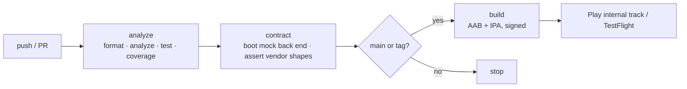

# 10 — CI/CD

## The pipeline

[`.github/workflows/ci.yml`](../.github/workflows/ci.yml)



Three jobs, ordered by how fast they fail. `analyze` runs in about two minutes
and catches most things; `build` costs a macOS runner and only runs when it can
produce something worth keeping.

### Job 1 — analyze

```yaml
- run: dart format --output=none --set-exit-if-changed lib test integration_test tool
- run: flutter analyze --fatal-warnings
- run: flutter test --coverage --reporter expanded
```

`--fatal-warnings` rather than `--fatal-infos`, deliberately. The strictness that
matters comes from `analysis_options.yaml`, which turns on `strict-casts` and
`strict-raw-types` — that is what stops an implicit `dynamic` from a JSON map
propagating into a widget, the single most common source of "works on my device"
crashes in an app that talks to five APIs. Making *infos* fatal would also fail
the build every time a Flutter minor release deprecates a constructor argument,
which trains people to ignore the job.

### Job 2 — contract

Boots the mock back end and runs `tool/contract_check.sh`. In this repo it
guards against a mock that has drifted from the client. Pointed at real vendor
sandboxes — which is what it is designed for — it is the job that catches
"SynXis changed a field" before it reaches a device.

Recommended: run it on a nightly schedule against the sandboxes as well as on
every PR against the mocks. Vendor changes do not respect your sprint boundary.

### Job 3 — build

Runs only on `main` and on `v*` tags. Decodes signing material from secrets
into `RUNNER_TEMP`, and builds an AAB and an IPA with the production
`--dart-define` values. The host projects are committed, so there is nothing to
generate first.

## Configuration and flavours

Configuration is compile-time only, via `--dart-define`
([`core/config/app_config.dart`](../lib/core/config/app_config.dart)):

| Flavour | API base | Logging | Notes |
|---|---|---|---|
| `dev` | `localhost:8080` | verbose | Mock back end |
| `staging` | staging BFF | verbose | Vendor sandboxes (SynXis CERT, Salesforce scratch org, CMS preview) |
| `prod` | production BFF | info only, bodies never logged | |

There is no `.env` file to accidentally commit and no runtime config fetch that
could fail on first launch. `AppConfig.verboseNetworkLogging` is false in
production, because request bodies contain guest PII and payment intents.

In CI the values come from repository **variables** (`vars.PROD_*`) for URLs and
**secrets** for anything sensitive, so a URL change does not need a secret
rotation.

## Signing

| Platform | Material | Storage |
|---|---|---|
| Android | Upload keystore (`.jks`), key alias + passwords | Base64 in `ANDROID_KEYSTORE_BASE64`, decoded to `$RUNNER_TEMP` and discarded with the runner |
| iOS | Distribution certificate, provisioning profile, App Store Connect API key | Fastlane Match (an encrypted git repo) or base64 secrets |

Nothing is echoed. No secret is interpolated into a shell string that could end
up in a log. Play App Signing means the upload key can be rotated without
locking anyone out of their installed app.

## Versioning

`--build-number=${{ github.run_number }}` gives a monotonic, never-reused build
number — which both stores require. The marketing version comes from
`pubspec.yaml` and is bumped in the release PR, so the version that shipped is
recoverable from git history alone.

## Release automation

The natural next step, with `fastlane`:

```ruby
# android
lane :internal do
  gradle(task: 'bundle', build_type: 'Release')
  upload_to_play_store(track: 'internal', release_status: 'draft')
end

# ios
lane :beta do
  build_app(scheme: 'Runner', export_method: 'app-store')
  upload_to_testflight(skip_waiting_for_build_processing: true)
end
```

A staged rollout (5% → 20% → 50% → 100%) with crash-rate gates between stages is
the pattern that matters for a booking app: a checkout regression caught at 5%
costs a few dozen guests, not a weekend of revenue.

## Observability in the pipeline

* Coverage uploaded as an artefact; a threshold gate is easy to add and easy to
  game, so it is worth setting per-directory rather than globally.
* Symbol files (`--split-debug-info`, `--obfuscate`) uploaded to the crash
  reporter as part of `build`, or stack traces from production are unreadable.
* Build-size tracking (`flutter build apk --analyze-size`) is worth a job of its
  own on an image-heavy app — it catches the day someone bundles a font family.

## What is missing, honestly

* No `fastlane` directory is committed here — the lanes above are the shape, not
  a tested configuration.
* No dependency-update automation. Dependabot or Renovate on `pubspec.yaml`,
  with the contract job as the gate, is the right pairing.
* No canary/feature-flag infrastructure. For a booking funnel, a server-driven
  flag on the checkout path (so a bad release can be turned off without a store
  round trip) would be the first thing to add.
