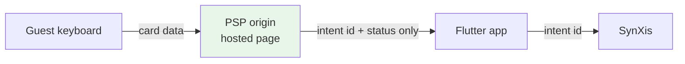

> Contract audit (2026-09-14): read [15-API-AUDIT.md](15-API-AUDIT.md) first. Vendor-shaped examples below describe the demo gateway, not certified production contracts. Payment/compliance statements are design intentions, not certifications.

# 11 — Security and data protection

A booking app handles card payments, passport-adjacent guest data and a points
balance with real monetary value. This document is the threat model and what was
done about it.

## PCI-DSS scope — the decision that matters most

**The app never sees card data.** The guest enters their card on the payment
provider's own hosted page, inside a WebView, on the PSP's origin.



Consequences:

* The mobile app qualifies for **SAQ-A** rather than SAQ-A-EP or SAQ-D.
* No release needs a PCI re-assessment for touching a card field, because there
  is no card field.
* 3-D Secure / SCA step-up works without us re-hosting the issuer's page.

If a future requirement asks for a native card form, the honest answer is: that
changes the compliance posture of every release, and the alternative is a PSP
SDK that tokenises in its own process (still not SAQ-A, but far better than
handling a PAN in Dart).

`PaymentResult` deliberately carries only `last4` and `brand`, and only for
display on the confirmation screen.

## Secrets: what may and may not ship in the binary

An APK is a zip file and `strings` is free. Assume anything in the binary is
public.

| Credential | Ships in the app? | Where it lives |
|---|---|---|
| CMS **delivery** token | Yes | Read-only, one space/environment, published content only |
| CMS **management** token | **No** | Server |
| SynXis client secret | **No** | BFF; the device gets a short-lived scoped token |
| Salesforce consumer **secret** | **No** | Not needed — PKCE has no secret |
| Salesforce consumer **key** (client id) | Yes | Public by design in OAuth |
| Leonardo.Ai API key | **No** | BFF, which also enforces per-user quotas — the vendor's own docs say not to embed it |
| PSP secret key | **No** | Server only |

The pattern throughout: **the handset authenticates to our BFF; the BFF holds
vendor credentials.** `AppConfig` is structured so that pointing an integration
at the BFF instead of the vendor is a URL change, not a code change.

## Token storage

`flutter_secure_storage`:

* **iOS** — Keychain, `first_unlock_this_device`. Not `always`, so a token is
  not readable before first unlock; not synchronised, so it does not travel to
  another device via iCloud Keychain.
* **Android** — EncryptedSharedPreferences, backed by the Android Keystore.

Tokens are treated as expired 60 seconds early, refresh is single-flight, and a
failed refresh clears the stored token rather than leaving a zombie session.

## OAuth

Authorization Code with **PKCE** (RFC 7636). No client secret in the binary. The
verifier never leaves the device; only its SHA-256 challenge travels. `state` is
verified on the callback. The redirect uses a custom scheme
(`luxestays://oauth/callback`) registered on the connected app, keeping the
redirect off the public web.

Detail in [04 — Salesforce](04-INTEGRATION-SALESFORCE.md).

## WebView hardening

The riskiest surface in a hybrid app. Four controls, all in
[`hybrid_webview.dart`](../lib/webview/hybrid_webview.dart) and
[`webview_bridge.dart`](../lib/webview/bridge/webview_bridge.dart):

1. **Navigation allowlist.** `onNavigationRequest` permits only origins in
   `AppConfig.webViewAllowedOrigins`; everything else is prevented and logged.
   A hybrid screen must not become a browser.
2. **Message-time origin check.** A `JavaScriptChannel` belongs to the WebView,
   not to a page — if the page navigates, the new origin can post to the same
   channel. Every inbound message therefore re-checks the WebView's **live** URL
   before dispatch. Registering the channel is not the boundary; this is.
3. **A closed message vocabulary.** `BridgeMessageType` is an enum, and
   `isInbound` is an allowlist. A bridge that dispatches on a method name
   supplied by the page is a remote-code-execution primitive.
4. **No string interpolation into JavaScript.** Everything crossing the boundary
   is `jsonEncode`d twice — once for the message, once to make a safely quoted
   JS literal. The same rule applies server-side, where `_jsString` escapes
   quotes, backslashes and `</` before any value reaches a `<script>` tag.

Plus: a 256 KB message cap, a handshake timeout, and `tryParse` that returns
`null` rather than throwing on malformed page input.

## Logging and PII

`AppLogger.redact` masks a defined set of keys — `authorization`,
`access_token`, `refresh_token`, `client_secret`, `password`, card fields,
`cvv`, `email`, `phone`, names, API keys — recursively, through nested maps and
lists, case-insensitively. It runs on **every** header and body before anything
reaches a sink.

`AppConfig.verboseNetworkLogging` is false in production, so bodies are not
logged at all there.

What *is* logged is the **correlation id**: a `ls_…` value generated per request
and sent to every vendor as `X-Correlation-Id`. Given a guest complaint at
14:32, that id follows one booking across four vendors, and it is what a support
agent quotes when raising a ticket with Sabre or Salesforce. `Failure` carries
it, `FailureView` displays it, and the Service Cloud case attaches it.

Pinned by [`test/core/redaction_test.dart`](../test/core/redaction_test.dart) —
because a redaction rule without a test is a redaction rule that silently stops
working.

## Transport

* HTTPS everywhere in staging and production. Cleartext is permitted only in
  the **debug** Android manifest and only for `localhost`
  (`android/app/src/debug/AndroidManifest.xml`), so the mock server works.
  Release builds never permit it.
* **Certificate pinning** is the natural next step for the payment and CRS
  hosts. It is not implemented here, and that is a deliberate omission rather
  than an oversight: pinning without a rotation plan and a kill switch turns a
  certificate renewal into an outage that no app update can fix quickly.

## Guest data

* `marketingOptIn` defaults to **false** and is captured explicitly, then
  propagated to the Salesforce contact record. Consent is never inferred.
* Guest details are held in memory for the duration of checkout and are not
  persisted.
* Special requests are free text and are sent to the CRS as-is — they are
  displayed to hotel staff, so they are treated as untrusted display data, never
  interpolated into anything executable.

## Build hardening

For a production release:

```bash
flutter build appbundle --release \
  --obfuscate --split-debug-info=build/symbols
```

with the symbol files uploaded to the crash reporter. Obfuscation is not a
security boundary — it raises the cost of casual reverse engineering, nothing
more. The actual boundary is that there is nothing valuable in the binary.

## Known gaps

Stated plainly, because a security section that claims completeness is not
credible:

* No certificate pinning (reasoning above).
* No jailbreak/root detection. For a booking app the value is low and the false
  positive rate is real.
* No biometric re-authentication before a payment. Worth adding for a saved-card
  flow; not applicable while every payment goes through a hosted page.
* The deferred-accrual outbox is in memory, so a force-quit between booking and
  accrual loses the local record. The server-side reconciliation is the real
  backstop; the app-side outbox should be persisted.
* Rate limiting is server-side only. The client retries with backoff and jitter,
  which is good citizenship, not enforcement.
